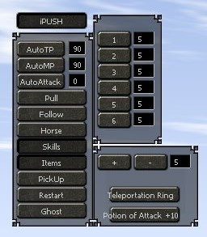
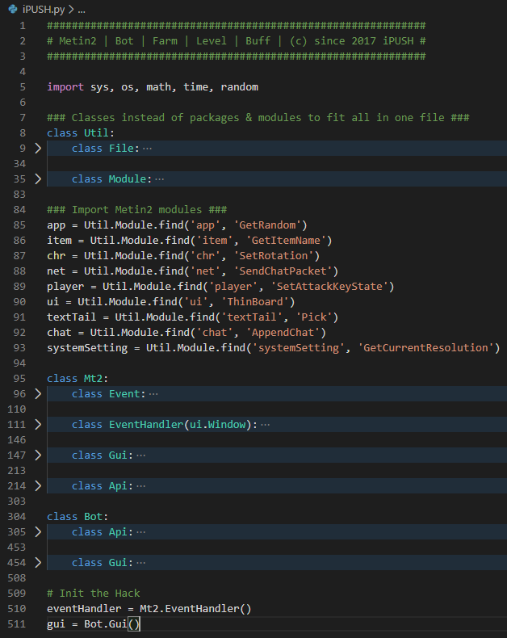

### Metin2 Farm Bot | Perfomant EventHandler | Module finder & dumper

# How to use
- Download my [bot](https://raw.githubusercontent.com/senseless-sage/metin2-bot/master/iPUSH.py)
- Download an [injector](https://github.com/master131/ExtremeInjector/releases/download/v3.7.3/Extreme.Injector.v3.7.3.-.by.master131.rar)
- Download a [python loader](http://www.elitepvpers.com/forum/metin2-hacks-bots-cheats-exploits-macros/4069225-pyloader-python-2-7-a.html)
- Inject the python loader and load my script

# Notes
- If the bot loads successfully, then the **iPUSH** button will appear in the left upper corner
- The **+** button in the **Items** menu, scans the item on your first inventory slot
- **Restart** uses the first 5 slots in your inventory every time u die
- Put ur **Horse** book on the 1st inventory slot
- Put ur **Pull** item on the 6st inventory slot
- **AutoAttack** values:
    - 0 = Monster
    - 2 = Metinstones
    - 6 = Other players

# Preview

# Project structure

